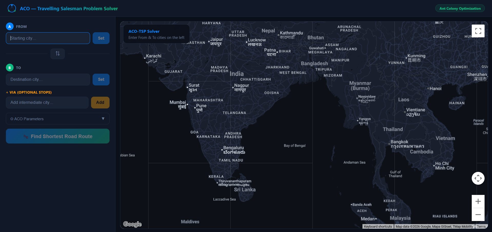
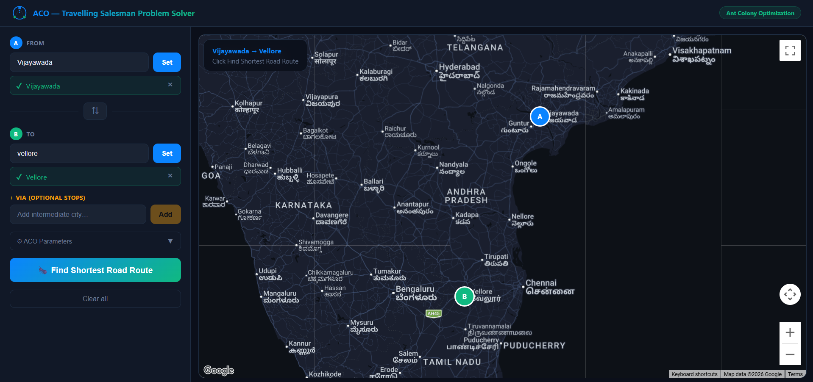
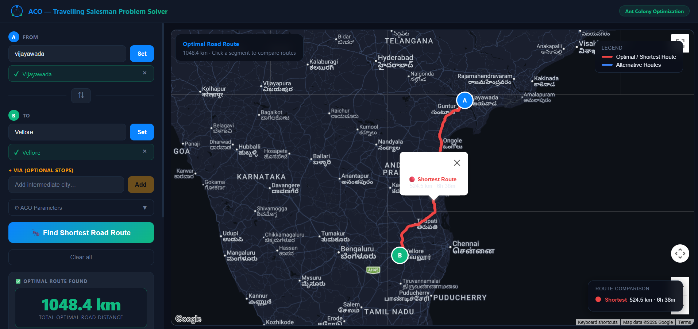
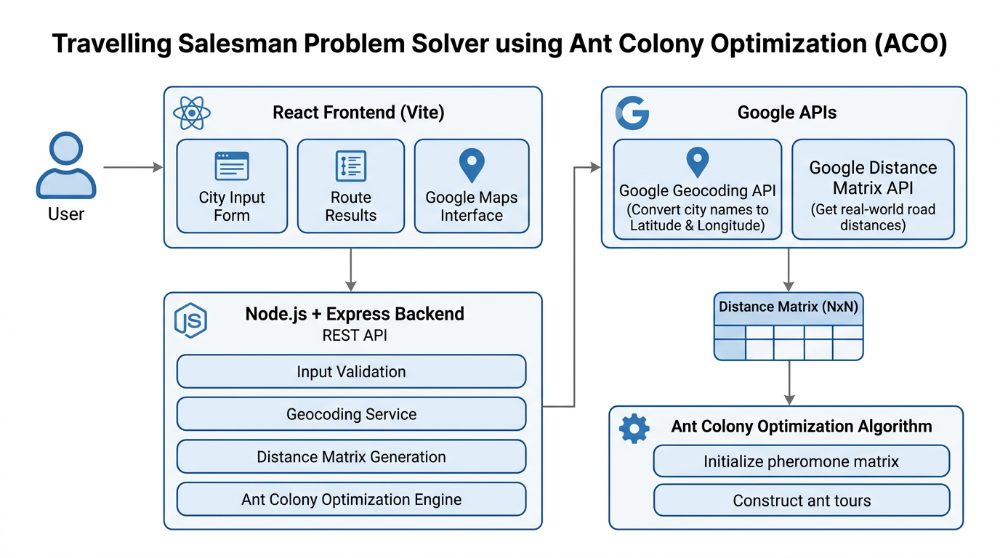

# Travelling Salesman Problem Solver using Ant Colony Optimization (ACO)

A full-stack web application that solves the Travelling Salesman Problem (TSP) using the Ant Colony Optimization (ACO) algorithm and visualizes the optimized route on Google Maps using real-world road distances.

---

## Project Overview

This project demonstrates how the Ant Colony Optimization (ACO) metaheuristic can be applied to solve the Travelling Salesman Problem using actual road network distances obtained from Google Maps APIs.

Users can enter multiple city names, and the application:

- Converts city names into geographic coordinates.
- Retrieves actual road distances between every pair of cities.
- Builds a distance matrix.
- Executes the Ant Colony Optimization algorithm.
- Finds the shortest possible route.
- Displays the optimized path on an interactive Google Maps interface.
- Shows the total travel distance.

---

## Features

- Accepts any number of city inputs
- Real-world road distance calculation using Google Distance Matrix API
- Automatic city geocoding
- Custom implementation of the Ant Colony Optimization algorithm
- Interactive Google Maps visualization
- Displays optimized route and total distance
- Responsive React user interface
- Node.js and Express backend
- Haversine distance fallback when Google APIs are unavailable
- OpenStreetMap geocoding fallback support

---

## Tech Stack

### Frontend

- React 18
- Vite
- HTML5
- CSS3
- JavaScript (ES6+)
- Google Maps JavaScript API

### Backend

- Node.js
- Express.js

### APIs

- Google Maps JavaScript API
- Google Distance Matrix API
- Google Geocoding API
- OpenStreetMap Nominatim API (Fallback)

### Algorithm

- Ant Colony Optimization (ACO)

---

## Ant Colony Optimization

The algorithm mimics the behavior of real ants that discover the shortest path between food sources by leaving pheromone trails.

### Transition Probability

```text
              τ(i,j)^α × η(i,j)^β
P(i,j) = -------------------------------
         Σ τ(i,l)^α × η(i,l)^β
```

Where

- τ(i,j) = Pheromone level on edge (i,j)
- η(i,j) = 1 / Distance
- α = Pheromone importance
- β = Heuristic importance

### Pheromone Update

```text
τ(i,j) = (1 − ρ) × τ(i,j) + Σ(Q / Lk)
```

Where

- ρ = Evaporation rate
- Q = Pheromone deposit constant
- Lk = Tour length of ant k

---

## Project Structure

```text
aco-tsp/
│
├── backend/
│   ├── algorithm/
│   ├── routes/
│   ├── services/
│   ├── utils/
│   ├── server.js
│   └── package.json
│
├── frontend/
│   ├── public/
│   ├── src/
│   ├── components/
│   ├── App.jsx
│   └── package.json
│
├── screenshots/
│   ├── home.png
│   ├── input-cities.png
│   ├── route-map.png
│   ├── optimal-route.png
│   └── architecture.png
│
└── README.md
```

---

## Installation

### Clone Repository

```bash
git clone https://github.com/niharikareddy018/TRAVELLING-SALESMAN-PROBLEM-USING-ACO.git

cd aco-tsp
```

---

### Backend Setup

```bash
cd backend

npm install

node server.js
```

---

### Frontend Setup

```bash
cd frontend

npm install

npm run dev
```

Open

```
http://localhost:5173
```

---

## Environment Variables

### Backend (.env)

```env
GOOGLE_MAPS_API_KEY=YOUR_GOOGLE_MAPS_API_KEY
```

### Frontend (.env)

```env
VITE_GOOGLE_MAPS_KEY=YOUR_GOOGLE_MAPS_API_KEY
```

---

## API Endpoints

| Method | Endpoint | Description |
|---------|----------|-------------|
| POST | /api/geocode | Convert place names into latitude and longitude |
| POST | /api/distance-matrix | Generate NxN road distance matrix |
| POST | /api/solve | Execute Ant Colony Optimization |
| GET | /health | Server health check |

---

## Default ACO Parameters

| Parameter | Value | Description |
|-----------|------:|-------------|
| Number of Ants | 25 | Ants per iteration |
| Iterations | 150 | Total iterations |
| Alpha | 1.0 | Pheromone importance |
| Beta | 2.0 | Distance heuristic importance |
| Evaporation Rate | 0.5 | Pheromone evaporation |
| Q Constant | 100 | Pheromone deposit factor |

---

## Screenshots

### Home Page



---

### City Input



---

### Google Maps Route Visualization


---

### Optimized Route



---

## System Architecture



---

## Future Enhancements

- Display multiple possible routes
- Compare ACO with Genetic Algorithm
- Route animation
- Export optimized route as PDF
- Traffic-aware route optimization
- Performance comparison for different optimization algorithms
- User authentication and saved routes

---

## License

This project is licensed under the MIT License.

---

## Author

**Niharika Muduru**

Integrated M.Tech Software Engineering

VIT-AP University

GitHub: https://github.com/niharikareddy018
